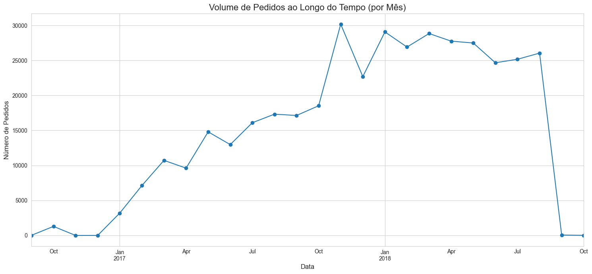
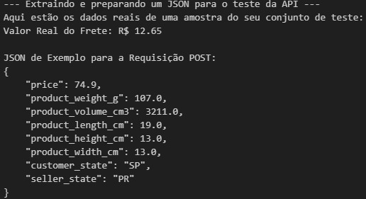
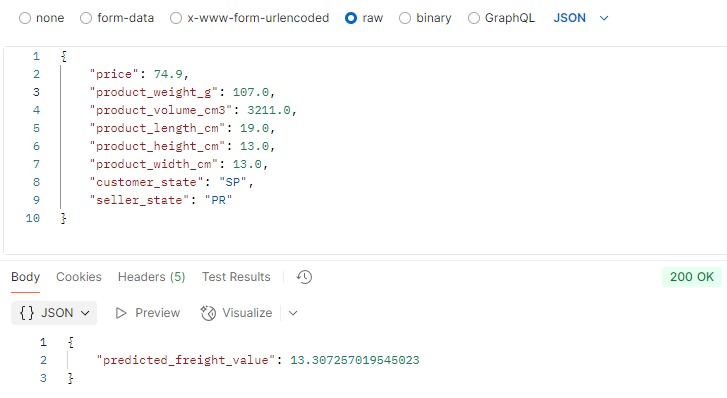

### **Projeto de Análise de Dados e Machine Learning em E-commerce**

Este projeto é um estudo de caso prático de um pipeline completo de dados, utilizando o **Olist Brazilian E-commerce Public Dataset**. O objetivo foi explorar os dados a fundo, extrair insights de negócio e construir modelos preditivos para otimizar operações e entender o comportamento do consumidor.

---

#### **1. Análise Exploratória de Dados (EDA)**

Com base na análise de gráficos e tabelas, as seguintes descobertas foram feitas:

* **Clientes e Pedidos:** O estado de **São Paulo (SP)** concentra o maior volume de pedidos. A performance de entrega da empresa é alta, com a maioria dos pedidos sendo entregue com sucesso.

* **Comportamento de Compra:** O pico de compras ocorre na **segunda-feira** e durante o período da tarde (**12h às 17h**).
* **Pagamentos:** O **cartão de crédito** é o método de pagamento preferido, especialmente para compras de maior valor.
* **Logística:** Embora a maioria das entregas ocorra no prazo, o atraso mais comum é de aproximadamente **72 horas**. Há uma forte correlação entre o tempo de entrega e a satisfação do cliente.

---

#### **2. Modelagem Preditiva e Analítica**

Uma série de modelos de Machine Learning foi desenvolvida para abordar desafios de negócio.

* **Previsão de Faturamento Mensal:** Foi feita uma tentativa de predizer o faturamento mensal usando dados de meses anteriores. A modelagem falhou, pois os dados eram escassos, o que serviu como um importante aprendizado sobre as limitações dos dados em um projeto de previsão.

* **Previsão de Satisfação do Cliente:** Foi criado um modelo de classificação para prever se um cliente ficaria satisfeito (nota 4 ou 5) com base em features como `price`, `freight_value` e características do produto. O modelo alcançou uma precisão de **96%**, com o `Random Forest Classifier` demonstrando um bom desempenho após a remoção de vazamentos de dados.

Segue um exemplo de dados reais do dataset e o resultado da predição.

Exemplo de requisição via Postman

* **Previsão do Valor do Frete (Modelo Principal):**
    * Esta foi a predição mais bem-sucedida e útil do projeto. Um modelo de **regressão** foi treinado para prever o `freight_value` com base nas características físicas e de preço do produto (`product_weight_g`, `product_volume_cm3`, `price`), bem como nas localizações do cliente e do vendedor (`customer_state`, `seller_state`).
    * O modelo alcançou um **R² de 0.96** e um **Erro Médio Absoluto (MAE) de R$ 1.17**, provando que é capaz de prever o custo do frete com alta precisão e de forma realista.

* **Segmentação de Clientes:** O algoritmo de clusterização `K-Means` foi utilizado para agrupar clientes em 4 segmentos distintos, identificados pelo `Método do Cotovelo`. A análise dos segmentos revelou grupos como "Clientes Ativos" e "Clientes Insatisfeitos".

---

#### **3. Ferramentas e Tecnologias**

* **Linguagem:** Python
* **Bibliotecas:** Pandas, Scikit-learn, Matplotlib, Seaborn, XGBoost, Joblib, Flask
* **Infraestrutura:** Snowflake (Data Warehouse)